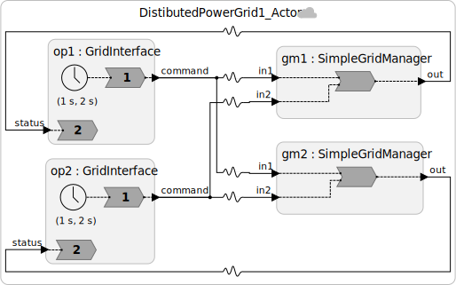

# Step 1: The Actor Model: Commutative Grid Dispatch

## The Problem We're Solving

Two control centers, one in California and one in New York, each manage a portion of the national grid. Both maintain a copy of the **grid balance**: a signed integer representing net generation in megawatts (positive = excess, negative = deficit).

Operators at either location can issue dispatch commands:
- **Dispatch up**: bring more generation online (+MW)
- **Curtail**: take generation offline (−MW)

Every dispatch command from either node must be seen by both nodes, so both copies of the grid balance stay in sync.

> **Why two copies?** Redundancy. If one control center loses network connectivity, it can still read the last-known balance and issue local dispatch decisions. This is the fundamental driver of distributed state.

---

## The Actor Approach

In the classical actor model, components communicate via **asynchronous message passing**. When a message arrives, a **reaction** (message handler) is invoked. The crucial property is: **the order in which messages from multiple sources are handled is not defined**.

Here is what our system looks like:




The squiggly arrows (`~>`) are **physical connections** in Lingua Franca: they use TCP for reliable in-order delivery on each link, but carry **no timestamp coordination** between links. Messages from California and New York may arrive at either grid manager in any order.

---

## The Code

See [`src/Step1_Actor.lf`](src/Step1_Actor.lf).

The core reactor is `SimpleGridManager`:

```lf
reactor SimpleGridManager {
  input in1: int   // commands arriving from California
  input in2: int   // commands arriving from New York
  output out: int  // current balance reported back to local operator

  state balance: int = 0

  reaction(in1, in2) -> out {=
    if (in1->is_present) {
        self->balance += in1->value;
        lf_print("California command %+d MW -> balance now %d MW",
                 in1->value, self->balance);
    }
    if (in2->is_present) {
        self->balance += in2->value;
        lf_print("New York command %+d MW -> balance now %d MW",
                 in2->value, self->balance);
    }
    lf_set(out, self->balance);
  =}
}
```

The top-level federated program wires everything together. For the first exercise, the operator consoles are scripted with parameters, so you can change the trace without writing new reactors or timers:

```lf
federated reactor {
    gi1 = new ScriptedGridInterface(
        node_name="California",
        command_value=100,
        command_time=0 ms
    )
    gi2 = new ScriptedGridInterface(
        node_name="New York",
        command_value=-100,
        command_time=1 ms
    )
    gm1 = new SimpleGridManager(node_name="California manager")
    gm2 = new SimpleGridManager(node_name="New York manager")

    gi1.command ~> gm1.in1    // California commands -> California manager (local)
    gi2.command ~> gm2.in2    // New York commands   -> New York manager (local)
    gi1.command ~> gm2.in1    // California commands -> New York manager (remote)
    gi2.command ~> gm1.in2    // New York commands   -> California manager (remote)

    gm1.out ~> gi1.status
    gm2.out ~> gi2.status
}
```

Each grid manager receives commands from **both** operators and keeps its own copy of the balance. The local operator console gets the balance back from its local manager.

---

## Running Step 1

Compile the LF program with `lfc`:

```bash
lfc src/Step1_Actor.lf
```

Because this is a federated LF program, compilation generates a launcher under `bin/` named after the source file:

```bash
./bin/Step1_Actor
```

This launches the runtime infrastructure (RTI) and the four federates:

- `federate__gi1`: California grid interface
- `federate__gi2`: New York grid interface
- `federate__gm1`: California grid manager
- `federate__gm2`: New York grid manager

To see each federate in its own terminal pane, run the launcher with `--tmux`:

```bash
./bin/Step1_Actor --tmux
```

If `tmux` is not installed, install it first, for example with `brew install tmux` on macOS or `sudo apt-get install tmux` on Ubuntu.

Inside the tmux view, the top pane is the RTI and the other panes are the federates. The program has a built-in timeout, so it should finish on its own. To leave and close the entire tmux session after the run, press `Ctrl+B`, then `D`. If you need to stop a still-running federation, press `Ctrl+C` in the RTI pane, then detach with `Ctrl+B`, then `D`.

Example tmux run:


In the screenshot, the managers receive the California and New York commands in different orders, but both managers end with balance `0 MW`.

---

## Why This Works, Sometimes

The operation `balance += value` has a special mathematical property: it is **associative and commutative**. It doesn't matter what order the additions happen; the final sum is always the same.

This means that even though `gm1` and `gm2` may process the same two commands in different orders, they will eventually agree on the same balance. This property is called **eventual consistency**.

More formally, this design satisfies **ACID 2.0** properties (Helland & Campbell):
- **A**ssociative: `(a + b) + c = a + (b + c)`
- **C**ommutative: `a + b = b + a`
- **I**dempotent: TCP guarantees exactly-once delivery, so each command is applied exactly once
- **D**istributed: state is maintained at multiple nodes

A datatype with these properties is called a **Conflict-Free Replicated Datatype (CRDT)**. This example is one of the simplest CRDTs in existence.

---

## The Catch

This design would allow operators to curtail generation far below zero, creating a dangerous grid imbalance that could trip protective relays and cause a cascading blackout.

Any **business logic** that enforces limits (e.g., "don't curtail if balance is already at its minimum threshold") breaks commutativity. That also breaks the consistency guarantee from this simple CRDT-style design.

That's what we explore next.

---

## Exercises

1. Trace through a scenario: California dispatches +100 MW at time 0 ms, New York curtails −100 MW at time 1 ms. Show that both grid managers reach the same balance regardless of message arrival order.

2. What would happen if TCP delivery were *not* guaranteed? How would the ACID 2.0 / CRDT properties need to change?

3. Now consider the potential effect of network delays in this example. How would network delays affect the consistency of this example?

---

**Next:** [Step 2: When Operations Are Non-Commutative](02-inconsistency.md)
