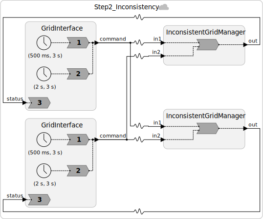

# Step 2: When Operations Are Non-Commutative: The Consistency Problem

## Adding Real Business Logic

The simple summation from Step 1 is a CRDT, which is mathematically elegant. But it lets operators destroy the grid: curtailment commands are always honored, even if the balance is already dangerously low.

Real grid operators enforce **safety constraints**. A typical rule:

> **Do not curtail generation if the current balance is already at or below the minimum safe threshold.**
>
> If a curtailment would push the balance below the threshold, reject it and log an **imbalance event** (which triggers automated protective relays in a real system).

Let's say our minimum safe threshold is **−200 MW**. Here is the updated reactor (See [`src/Step2_Inconsistency.lf`](src/Step2_Inconsistency.lf)).


```lf
reactor InconsistentGridManager {
    input in1: int
    input in2: int
    output out: int

    state balance: int = 0

    reaction(in1, in2) -> out {=
        if (in1->is_present) {
            if (self->balance + in1->value >= MIN_SAFE_BALANCE) {
                self->balance += in1->value;
            } else {
                lf_print("WARNING: Imbalance event! Curtailment rejected.");
                // In a real system: trip protective relays, alert operators
            }
        }
        if (in2->is_present) {
            if (self->balance + in2->value >= MIN_SAFE_BALANCE) {
                self->balance += in2->value;
            } else {
                lf_print("WARNING: Imbalance event! Curtailment rejected.");
            }
        }
        lf_set(out, self->balance);
    =}
}
```

Here is what our system looks like:




---

## Why This Breaks Consistency

This new operation is **not commutative**. The result of applying two commands depends on the order in which they are applied. Consider this scenario:

**Initial state:** both managers have `balance = −150 MW`.

**Two simultaneous commands:**
- California: curtail −80 MW (would bring balance to −230 MW, below threshold)
- New York: dispatch +100 MW (would bring balance to −50 MW)

**Scenario A: California manager sees curtail first:**
1. California curtail (−80): `−150 + (−80) = −230`. Below threshold → **rejected**.
2. New York dispatch (+100): `−150 + 100 = −50`. Applied.
3. Final balance at `gm1`: **−50 MW**. No imbalance event.

**Scenario B: California manager sees dispatch first:**
1. New York dispatch (+100): `−150 + 100 = −50`. Applied.
2. California curtail (−80): `−50 + (−80) = −130`. Above threshold → **applied**.
3. Final balance at `gm1`: **−130 MW**. No imbalance event.

Since `gm1` and `gm2` receive these messages over physical (unordered) connections, they may each experience a different scenario. **They permanently disagree on the balance**, and worse, they may disagree on whether an imbalance event occurred.

This is the fundamental consistency problem in distributed systems.

---

## Visualizing the Inconsistency

```
Time →
                    T=0ms               T=10ms (approx)
California node:    curtail -80 ──────────────────────────► gm1 sees it first
New York node:                   dispatch +100 ────────────► gm1 sees it second
                                                                   ↓
                                                          gm1 final: -50 MW ✓ no event

California node:    curtail -80 ────────────────────────────────────────────────► gm2 sees it second  
New York node:                   dispatch +100 ──────────────────────────────► gm2 sees it first
                                                                                     ↓
                                                                           gm2 final: -130 MW ✓ no event

But gm1 (-50) ≠ gm2 (-130): INCONSISTENT STATE!
```

In a real grid, this inconsistency means the two control centers have **contradictory views of grid health**. Automated systems making decisions based on these views could take opposing corrective actions, worsening the situation.

---

## Fixing It: The Options

We'll explore three approaches to fix the inconsistency issue:

| Approach | How | Cost |
|----------|-----|------|
| **Single node** | Keep balance at one node only | Single point of failure; unavailability on network loss |
| **Timestamps** | Tag commands with logical time; enforce ordered processing | Wait time proportional to network latency (CAL theorem) |
| **Chandy-Misra** | Conservative coordination with null messages | Same wait time; tight coupling; blocks on node failure |

The single-node approach defeats the purpose of having two control centers. So we turn to timestamps.

---

## Exercises

1. Construct a scenario where `gm1` logs an imbalance event but `gm2` does not, starting from `balance = -180 MW`. What does this mean operationally for a real grid?

2. Would the inconsistency be resolved if the network always delivered messages in the order they were sent globally (i.e., a totally ordered broadcast)? What would be the cost?

3. Fixing commutativity "loses most of these nice properties." List the specific ACID 2.0 properties that are lost when we add the threshold check.

---

**Next:** [Step 3: Adding Logical Timestamps](03-timestamps.md)
