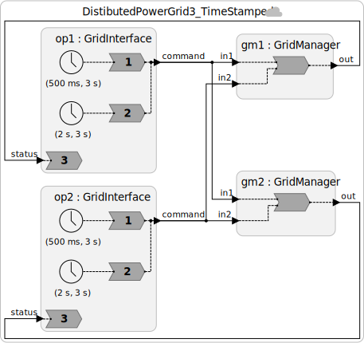

# Step 3: Logical Timestamps — Ordering Events Across the Grid

## The Core Insight

When a California operator curtails generation at the same physical instant that a New York operator dispatches generation, there is no objective "ground truth" about which happened first. Special relativity tells us the ordering can depend on the observer — and for events separated by thousands of kilometers, the difference in light travel time is measurable.

Fortunately, we don't need ground truth. We just need **both control nodes to agree on the same ordering** — and for that ordering to look reasonable to human operators. Logical timestamps achieve exactly this.

---

## What Is Logical Time?

Lingua Franca assigns a **timestamp** to every message at the point it is created. In a federated (distributed) program, each node uses its **local physical clock** to assign timestamps. Clock synchronization protocols like NTP, PTP, or GPS ensure that these clocks are close to each other — within a bounded error `ε`.

A timestamp becomes a **logical time** because:
- When Node A sends a message with timestamp `t`, Node B processes it at logical time `t` — even if Node B's physical clock has already advanced past `t`.
- Logical time is a shared reference frame that both nodes agree on, independent of physical clock drift.

---

## The Change: `~>` → `->`

The only syntactic change in the Lingua Franca program is replacing physical connections with **logical connections**:

| Syntax | Type | Semantics |
|--------|------|-----------|
| `a.out ~> b.in` | Physical connection | Messages delivered ASAP, no timestamp ordering |
| `a.out -> b.in` | Logical connection | Messages carry timestamps; reactor must handle them in timestamp order |


```lf
// Before (Step 2): physical, unordered
op1.command ~> gm1.in1
op1.command ~> gm2.in1

// After (Step 3): logical, timestamp-ordered
op1.command -> gm1.in1
op1.command -> gm2.in1
```

This small change has a profound effect: LF now **guarantees** that both `gm1` and `gm2` handle every pair of commands in the same logical time order.

---

## Code

See [`src/DistibutedPowerGrid3_TimeStamped.lf`](src/DistibutedPowerGrid3_TimeStamped.lf). And here is what our system looks like:




Key differences from Step 2:
1. Connections use `->` instead of `~>`
2. `GridManager` has an `STA` parameter
3. No other changes to the reactor logic — timestamp ordering is handled by the LF runtime

---

## Simultaneous Events

Timestamps introduce a new possibility that doesn't exist in the classical actor model: **two messages can have the same timestamp** (i.e., they are logically simultaneous).

In our grid manager, the reaction `reaction(in1, in2)` fires once with both inputs present when they share the same timestamp. The reaction body then handles them in a **deterministic order** (in1 before in2, as written), and this order is identical at both grid managers.

```lf
reaction(in1, in2) -> out {=
    // in1 is always processed before in2.
    // Both gm1 and gm2 execute this logic in the same order
    // at any given logical timestamp -> consistent state.
    if (in1->is_present) { /* ... */ }
    if (in2->is_present) { /* ... */ }
    lf_set(out, self->balance);
=}
```

Because the connection wiring is symmetric (California always feeds `in1`, New York always feeds `in2` at both managers), both managers give priority to the California operator at simultaneous timestamps. This is a deterministic policy — not the most fair one, but a consistent one.

---

## The Cost: Waiting

To process a message at timestamp `t`, the grid manager must be sure it has received **all** messages with timestamp ≤ `t`. Otherwise, a late-arriving message (from the other node) could violate timestamp order.

This creates an unavoidable wait. The LF **decentralized coordinator** manages this via the **STA (Safe To Advance)** parameter:

```lf
reactor GridManager(STA: time = 100 ms) {
    // ...
}
```

A grid manager with `STA = 100 ms` waits until its local physical clock reads `T ≥ t + 100 ms` before processing a message at logical time `t`. This ensures that any message from the remote node with timestamp less than `t` has had at least 100 ms to arrive.

This is correct as long as:

> **clock sync error + network latency ≤ STA**

For two nodes in California and New York (cross-continental latency ~60–80 ms), an STA of 100 ms provides a modest safety margin with NTP synchronization (~10–50 ms error). Google Spanner achieves tighter bounds using GPS and dedicated fiber.

---

## The CAL Theorem Preview

The waiting introduced by timestamps is not a bug — it is **fundamental**. The **CAL theorem** (Lee et al., 2023) states:

> It is impossible to achieve consistency without paying a price in **availability**, where the price is proportional to the latencies in the system.

"Availability" here means: how long must an operator wait before their dispatch command takes effect? The longer the STA, the more consistent the system — and the longer operators wait. We'll return to this in Step 6.

---

## Exercises

1. With `STA = 100 ms` and cross-continental latency of 75 ms, what is the maximum clock synchronization error you can tolerate and still guarantee correct ordering?

2. If you reduced STA to 20 ms to improve responsiveness, what would happen if a message arrived 30 ms late? What would the LF runtime do (hint: see the `fault handler` concept)?

3. Revisit the inconsistency scenario from Step 2 (balance = −150 MW, simultaneous curtail and dispatch). Trace through the execution with timestamps. Do both grid managers reach the same balance?

---

**Next:** [Step 4 — Conservative Coordination with Null Messages](04-conservative.md)
