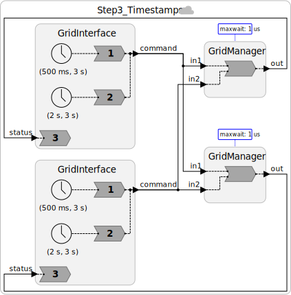

# Step 3: Logical Timestamps: Ordering Events Across the Grid

## The Core Insight

When a California operator curtails generation at the same physical instant that a New York operator dispatches generation, there is no objective "ground truth" about which happened first. Special relativity tells us the ordering can depend on the observer, and for events separated by thousands of kilometers, the difference in light travel time is measurable.

Fortunately, we don't need ground truth. We need **both control nodes to agree on the same ordering**, and for that ordering to look reasonable to human operators. Logical timestamps achieve exactly this.

---

## What Is Logical Time?

Lingua Franca assigns a **timestamp** to every message at the point it is created. In a federated (distributed) program, each node uses its **local physical clock** to assign timestamps. Clock synchronization protocols like NTP, PTP, or GPS keep these clocks close to each other, within a bounded error `ε`.

A timestamp becomes a **logical time** because:
- When Node A sends a message with timestamp `t`, Node B processes it at logical time `t`, even if Node B's physical clock has already advanced past `t`.
- Logical time is a shared reference frame that both nodes agree on, independent of physical clock drift.

---

## The Change: `~>` → `->`

The only syntactic change in the Lingua Franca program is replacing physical connections with **logical connections**:

| Syntax | Type | Semantics |
|--------|------|-----------|
| `a.out ~> b.in` | Physical connection | Messages delivered ASAP, no timestamp ordering |
| `a.out -> b.in` | Logical connection | Messages carry timestamps; reactor must handle them in timestamp order |


```lf
// Before (Step 2): physical, unordered
gi1.command ~> gm1.in1
gi1.command ~> gm2.in1

// After (Step 3): logical, timestamp-ordered
gi1.command -> gm1.in1
gi1.command -> gm2.in1
```

This small change has a profound effect: LF now gives both `gm1` and `gm2` the same logical timestamps and a deterministic rule for processing them, provided the coordination assumptions are met.

---

## Code

See [`src/Step3_Timestamps.lf`](src/Step3_Timestamps.lf). And here is what our system looks like:




Key differences from Step 2:
1. Connections use `->` instead of `~>`
2. `GridManager` has a `maxwait` attribute
3. No other changes to the reactor logic; timestamp ordering is handled by the LF runtime

---

## Simultaneous Events

Timestamps introduce a new possibility that doesn't exist in the classical actor model: **two messages can have the same timestamp** (i.e., they are logically simultaneous).

In our grid manager, the reaction `reaction(in1, in2)` fires once with both inputs present when they share the same timestamp. The reaction body then handles them in a **deterministic order** (in1 before in2, as written), and this order is identical at both grid managers.

```lf
reaction(in1, in2) -> out {=
    // in1 is always processed before in2.
    // Both gm1 and gm2 execute this logic in the same order
    // at any given logical timestamp -> consistent state.
    if (in1->is_present) { /* ... */ }
    if (in2->is_present) { /* ... */ }
    lf_set(out, self->balance);
=}
```

Because the connection wiring is symmetric (California always feeds `in1`, New York always feeds `in2` at both managers), both managers give priority to the California operator at simultaneous timestamps. This is a deterministic policy. It may not be the fairest policy, but it is consistent.

---

## The Cost: Waiting

To process a message at timestamp `t`, the grid manager must be sure it has received **all** messages with timestamp ≤ `t`. Otherwise, a late-arriving message (from the other node) could violate timestamp order.
Such a late-arriving message is said to be **tardy**.

This creates an unavoidable wait. The LF **decentralized coordinator** manages this via the **maxwait** attribute:

```lf
  @maxwait(100 ms)
  gm1 = new GridManager()
```

A grid manager with `maxwait = 100 ms` advances to a logical time `t` when either:
1. It has received inputs with timestamps `t` or more on both inputs, or
2. Its local physical clock reads `T ≥ t + 100 ms`.

This ensures that any message from the remote node with timestamp less than `t` has had at least 100 ms to arrive.

This is correct as long as:

> **clock sync error + network latency ≤ maxwait**

For two nodes in California and New York (cross-continental latency ~60–80 ms), a `maxwait` of 100 ms provides a modest safety margin with NTP synchronization (~10–50 ms error). Google Spanner achieves tighter bounds using GPS, the precision time protocol (PTP), and dedicated fiber trunks.

---

## Handling Faults

Tardy events, if not handled, result in messages like this:

```
Fed 3 (gm2_main): ERROR: STP violation occurred in a trigger to reaction 1, and there is no handler.
**** Invoking reaction at the wrong tag!
```

To intentionally trigger this error in [`src/Step3_Timestamps.lf`](src/Step3_Timestamps.lf):

1. Temporarily remove the `tardy {= ... =}` block attached to the `GridManager` reaction.
2. Make both `GridManager` `@maxwait` values very small, for example `@maxwait(1 us)` or `@maxwait(0 ms)`.
3. Compile and run:

   ```bash
   lfc src/Step3_Timestamps.lf
   ./bin/Step3_Timestamps
   ```

With a very small `maxwait`, a grid manager may advance logical time before an earlier remote message arrives. Without a tardy handler, the runtime reports the STP violation. After observing the error, restore the `tardy` block and return `maxwait` to `100 ms`.

Tardy events may be handled with a **tardy handler**.
For example, we can add the following to the `GridManager` reaction:

```lf
  reaction(in1, in2) -> out {=
    ...
  =} tardy {=
    tag_t intended_tag;
    if (in1->is_present) {
      intended_tag = in1->intended_tag;
    } else {
      intended_tag = in2->intended_tag;
    }
    lf_print_warning("[ts=%lld] Tardy message with intended timestamp %lld received at physical time %lld",
        lf_time_logical_elapsed(), intended_tag.time - lf_time_start(), lf_time_physical_elapsed());
  =}
```

This handler will be invoked _instead of_ the normal reaction when a tardy message arrives.
This example shows how to extract the **intended tag**, which is a timestamp, microstep pair.
For this grid application, merely printing a warning like this is probably not the right thing to do.
What could you do better?


In some cases, it is actually OK to handle tardy messages just like ordinary messages.
The `GridInterface` reactor used to generate test cases is an example of this.
Its `status` input is used to report the balance as viewed by the local GridManager.
If it is OK for these reports to be made late, then we can annotate the reaction with an empty `tardy` handler, as follows:

```
  reaction(status) {=
    lf_print("%s balance: %d MW", self->node_name, status->value);
  =} tardy // Handle tardy messages like any other message.
```

---

## The CAL Theorem

The waiting introduced by timestamps is not a bug; it is **fundamental**. The **CAL theorem** ([Lee et al., 2023](https://doi.org/10.1145/3609119)) states:

> It is impossible to achieve consistency without paying a price in **availability**, where the price is proportional to the latencies in the system.

"Availability" here means: how long must an operator wait before their dispatch command takes effect? A larger `maxwait` can tolerate larger apparent latency, but operators may wait longer. We'll return to this in Step 6.

---

## Exercises

1. Change `@maxwait` on both managers to `forever` and rerun. Does the program make progress? Why or why not?

---

**Next:** [Step 4: Conservative Coordination with Null Messages](04-conservative.md)
