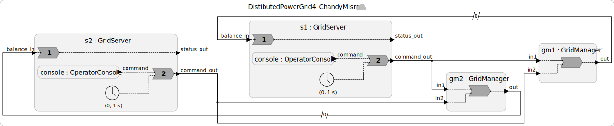

# Step 4: Conservative Coordination: Chandy-Misra with Null Messages

## The Problem with Finite maxwait

In Step 3, we set `maxwait = 100 ms`. This means:

- The grid manager may wait 100 ms after logical time `t` before processing a message at `t`.
- This is safe (avoids tardy messages) if every remote message arrives within 100 ms of its timestamp.

But what if the link between California and New York goes down for 5 minutes? Or a router becomes congested and introduces 500 ms of latency? The `maxwait = 100 ms` assumption is violated.
If a local event has caused logical time to advance, then when the message finally arrives, it will be tardy,
and the LF runtime will invoke the **tardy handler**.

An alternative approach avoids making assumptions about latency altogether.

---

## Conservative Coordination: Wait Until You Know

Instead of guessing that all messages will arrive within some time budget, the **conservative approach** says:

> A node must not process a message at tag `g` until it has proof that no message with tag `g` or less will later arrive.

In LF, messages on a connection from one federate to another are delivered reliably in order.
Moreover, all messages on such a connection have strictly increasing tags, where a **tag** is a timestamp, microstep pair, `g = (t, m)`.
Hence, when a message has arrived on an input port with some tag `g`, the receiving federate knows it has already received all messages with earlier tags on this input port.

The [Chandy-Misra approach (1979)](https://doi.org/10.1109/TSE.1979.230182), originally developed for distributed simulation, waits to advance to a tag `g` until a message has been received on **every** input port with tag at least `g`.
LF supports this method via `maxwait = forever`:

```lf
  @maxwait(forever)
  gm1 = new GridManager()
```

With `maxwait = forever`, the grid manager will wait **indefinitely** until it receives positive evidence from the remote node that no message with tag ≤ `g` is coming.

Of course, waiting forever sounds like a bad idea.
What if the remote `GridInterface` has no real commands to send?
How does the evidence arrive? That's where **null messages** come in.

---

## Null Messages

In our grid, commands are sent only when operators issue dispatches or curtailments. If California issues no commands for 10 minutes, New York's manager has no evidence about California's timeline and blocks forever under `maxwait = forever`.

The fix: California's node sends **null messages** periodically. A null message says:

> "I have no real command at this timestamp, but here is my current timestamp. You may safely advance past it."

In the grid context, a null message with value `0` can be used as "no change in dispatch." It is a heartbeat that lets the remote manager advance logical time even during quiet periods.
We create a `GridServer` that wraps the `OperatorConsole` and sends null messages periodically when the console has nothing to say:

```lf
reactor GridServer(null_message_period: time = 1 s) {
  input balance_in: int  // balance feedback from local GridManager
  output command_out: int  // real or null command, forwarded to GridManagers

  console = new OperatorConsole()

  timer heartbeat(0, null_message_period)  // Null-message heartbeat timer: fires every null_message_period

  // On each heartbeat: forward real command if present, else null message
  reaction(console.command, heartbeat) -> command_out {=
    if (console.command->is_present) {
        lf_set(command_out, console.command->value);
    } else {
        // Null message: advances remote logical time, no grid effect
        lf_set(command_out, 0);
    }
  =}

  // Print balance to operator display
  reaction(balance_in) {=
    lf_print("Grid balance = %d MW", balance_in->value);
  =} tardy // Handle tardy messages like any other message.
}
```

The timer fires every second. If no real command has arrived, a `0` is forwarded, which the grid manager interprets as "no change." This lets the grid manager advance its logical time by at least 1 second per second, bounding the wait.

---

## Guarantees and Costs

**What you get:**
- **Strong consistency**: both grid managers agree on the balance at every logical timestamp. No tardy violations, ever.
- **Bounded wait**: the maximum wait is ~1 second (the null message period) plus network latency.

**What you give up:**
- **Availability under failure**: if the California `GridServer` crashes, it stops sending null messages. New York's manager blocks indefinitely because it has no proof that California won't send a message.
- **Network overhead**: null messages are sent every second even when there are no real commands. For a grid with hundreds of nodes, this multiplies.

This is the CAL theorem in action: **strong consistency costs availability when network behavior is unbounded**.

---

## Code

See [`src/Step4_Conservative.lf`](src/Step4_Conservative.lf). Here is what our system looks like:



Key changes from Step 3:
- `GridInterface` is wrapped in `GridServer`, which adds a null-message timer.
- `GridManager` has `maxwait = forever`.
- Logical connections (`->`) are retained.

---

## Exercises

1. Trace through a scenario where California's GridServer crashes at time T = 30 s. What happens to New York's grid manager? What happens to California's grid manager?

2. If we reduce the null message period from 1 s to 100 ms, how does this affect (a) wait time, (b) network overhead, and (c) resilience to node failure?

3. Could we use `maxwait = forever` with *no* null messages at all? Under what circumstances would the system make progress?

---

**Next:** [Step 5: Hybrid Design: Fast-Path for Safe Commands](05-hybrid.md)
