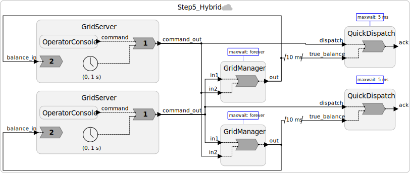

# Step 5: Hybrid Design: Fast-Path for Safe Commands

## Motivation: Not All Commands Are Equal

In Step 4, every dispatch command, whether it dispatches 10 MW or curtails 500 MW, waits up to ~1 second for null messages before being processed. For a power grid, that latency may be unacceptable for routine operations, while being entirely appropriate for high-risk commands.

Consider the difference:

| Command | Risk | Desired Response |
|---------|------|-----------------|
| Dispatch +100 MW (generation surplus) | Low: adding generation cannot cause imbalance | Fast (< 30 ms) |
| Curtail −200 MW (dangerous near threshold) | High: could cause cascading failure | Slow but consistent (wait for full coordination) |

A **hybrid design** lets us offer both: a fast path for safe commands, and a slow-but-consistent path for risky ones.

---

## The Architecture

We add a third reactor to the federation: `QuickDispatch`. This reactor runs with a *finite* maxwait (say, 30 ms) and handles **only dispatch-up commands** (positive values). It responds quickly to operators, without waiting for the remote node.

The `GridManager` (from Step 4, with `maxwait = forever`) continues to maintain the **authoritative balance**, updated by all commands including curtailments. `QuickDispatch` receives the authoritative balance as a secondary input, which it uses to double-check its fast-path decisions.


And here is what our system looks like:


---

## The `QuickDispatch` Reactor

```lf
reactor QuickDispatch {
  input dispatch: int      // from local GridServer (commands only)
  input true_balance: int  // from local GridManager (authoritative)
  output ack: int          // fast acknowledgement to operator

  state balance: int = 0

  // Normal path: true_balance arrives before or with dispatch
  reaction(true_balance, dispatch) -> ack {=
    if (true_balance->is_present) {
        self->balance = true_balance->value;
    }
    if (dispatch->is_present && dispatch->value > 0) {
        // Only handle dispatch-up on fast path
        self->balance += dispatch->value;
        lf_set(ack, self->balance);
        lf_print("[ts=%lld] QuickDispatch: fast ack +%d MW -> est. balance %d MW",
                 lf_time_logical_elapsed(), dispatch->value, self->balance);
    }
    // Negative commands (curtailments) are silently ignored here.
    // They are handled by GridManager on the slow, consistent path.
  =} tardy {=
    // Fault path: true_balance arrived LATE (out of timestamp order).
    // Correct our estimate and log the anomaly.
    if (true_balance->is_present) {
        lf_print("[ts=%lld] QuickDispatch: late true_balance arrived (%d MW), "
                 "correcting estimate from %d MW.",
                 lf_time_logical_elapsed(), true_balance->value, self->balance);
        self->balance = true_balance->value;
    }
    if (dispatch->is_present && dispatch->value > 0) {
        // A fast dispatch may have used a stale estimate.
        // For dispatch-up this is generally safe; log for audit trail.
        lf_print("[ts=%lld] QuickDispatch: WARNING: dispatch of +%d MW "
                 "processed with stale balance estimate. "
                 "Operator acknowledged %d MW (may differ from true balance).",
                 lf_time_logical_elapsed(), dispatch->value, self->balance);
    }
  =}
}
```

The **business logic** in the tardy fault handler is a key design decision:
- For dispatch-up commands: the fault is benign. Adding generation with a slightly stale estimate is safe.
- For curtailment commands: QuickDispatch doesn't handle these, so the fault handler ignores them.

---

## What About Curtailments?

Curtailment commands (negative values) flow only through `GridManager` with `maxwait = forever`. Operators issuing curtailments must wait for full cross-node coordination. This is deliberate: curtailments near the safety threshold are the highest-risk operation and deserve the strongest consistency guarantee.

This is a **business decision embedded in the architecture**, not just a technical constraint:

> Accept some extra latency for curtailments in exchange for preventing cascading failures.

Many real-world variations are possible. For example, small curtailments (< 20 MW) could also use the fast path, while large ones use the slow path.

---

## Code

See [`src/Step5_Hybrid.lf`](src/Step5_Hybrid.lf).

This step introduces LF's [**import statement**](https://www.lf-lang.org/docs/writing-reactors/composing-reactors/#import-statement): `import GridServer from "Step4_Conservative.lf"` reuses the `GridServer` reactor from the previous step instead of redefining it in this file.

---

## Exercises

[**Logical delays**](https://www.lf-lang.org/docs/writing-reactors/composing-reactors/#connections-with-logical-delays) use the `after` keyword, as in `a.out -> b.in after 10 ms`, to deliver an event at a later logical time than the reaction that produced it.

1. Add `after 10 ms` to the `GridManager.out -> QuickDispatch.true_balance` connection. Does the tardy handler fire more often? How does the `after` delay shift the point where the fast-path estimate gets corrected?

2. Add a `state fault_count: int = 0` to `QuickDispatch` and increment it in the `tardy` handler. Print the running count after each tardy event. Set the `QuickDispatch` instances to `@maxwait(10 ms)` and simulate a 75 ms delay in physical time by using `lf_sleep(MSEC(75));` in the `GridManager` reaction before it sets `out`. How quickly does the fault count grow?

   Hint: `lf_sleep` is part of the LF C target's platform API; include `platform.h` in a preamble before using it. The LF docs list `lf_sleep` among [available libraries requiring `#include`](https://www.lf-lang.org/docs/next/reference/target-language-details/#available-libraries-requiring-include), define it as pausing execution for a duration in the [C platform API](https://www.lf-lang.org/reactor-c/group__Platform.html#ga9a43894d4caf7e2fc1e75b9b49d7285d), and show a similar use in the [physical actions example](https://www.lf-lang.org/docs/next/writing-reactors/actions/#physical-actions).

3. Add a `QuickCurtail` reactor (mirroring `QuickDispatch`) that fast-paths small curtailments up to −20 MW with `@maxwait(30 ms)`. What should its `tardy` handler do when `true_balance` arrives late and reveals the curtailment pushed the balance below the threshold?

---

**Next:** [Step 6: The CAL Theorem: Fundamental Limits](06-cal-theorem.md)
