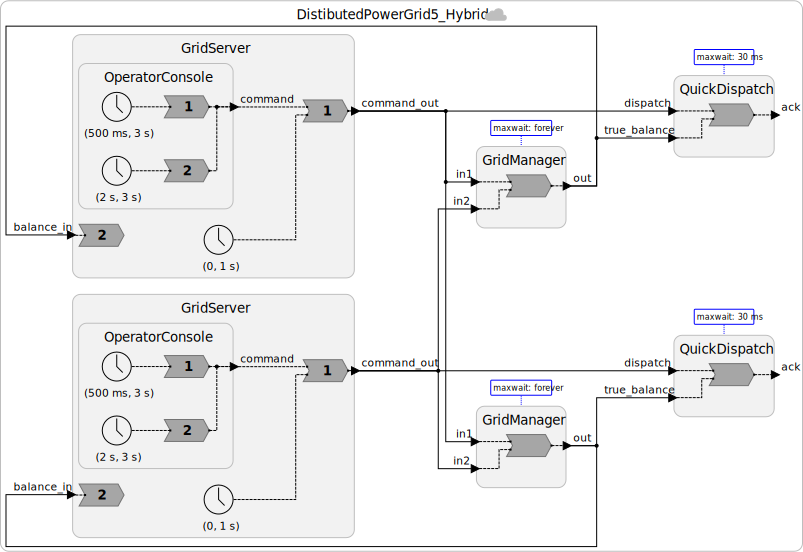

# Step 5: Hybrid Design — Fast-Path for Safe Commands

## Motivation: Not All Commands Are Equal

In Step 4, every dispatch command — whether it dispatches 10 MW or curtails 500 MW — waits up to ~1 second for null messages before being processed. For a power grid, that latency may be unacceptable for routine operations, while being entirely appropriate for high-risk commands.

Consider the difference:

| Command | Risk | Desired Response |
|---------|------|-----------------|
| Dispatch +100 MW (generation surplus) | Low — adding generation cannot cause imbalance | Fast (< 30 ms) |
| Curtail −200 MW (dangerous near threshold) | High — could cause cascading failure | Slow but consistent (wait for full coordination) |

A **hybrid design** lets us offer both: a fast path for safe commands, and a slow-but-consistent path for risky ones.

---

## The Architecture

We add a third reactor to the federation: `QuickDispatch`. This reactor runs with a *finite* STA (say, 30 ms) and handles **only dispatch-up commands** (positive values). It responds quickly to operators, without waiting for the remote node.

The `GridManager` (from Step 4, with `STA = forever`) continues to maintain the **authoritative balance** — updated by all commands including curtailments. `QuickDispatch` receives the authoritative balance as a secondary input, which it uses to double-check its fast-path decisions.


And here is what our system looks like:


---

## The `QuickDispatch` Reactor

```lf
reactor QuickDispatch(STA: time = 30 ms) {
    input dispatch: int         // commands from local operator
    input true_balance: int     // authoritative balance from GridManager

    output ack: int             // fast acknowledgement to operator

    state balance: int = 0      // local estimate of balance

    reaction(true_balance, dispatch) -> ack {=
        // Update local estimate whenever authoritative balance arrives
        if (true_balance->is_present) {
            self->balance = true_balance->value;
        }
        // Fast-path: only process dispatch-up commands
        if (dispatch->is_present && dispatch->value > 0) {
            self->balance += dispatch->value;
            lf_set(ack, self->balance);
            lf_print("QuickDispatch: fast ack +%d MW -> est. balance %d MW",
                     dispatch->value, self->balance);
        }
        // Negative (curtailment) commands are ignored here;
        // they are handled by GridManager on the slow path.
    =} STAA(0) {=
        // Fault handler: called if true_balance arrives AFTER dispatch
        // has already been processed at this timestamp (out-of-order).
        if (true_balance->is_present) {
            self->balance = true_balance->value;  // correct our estimate
        }
        if (dispatch->is_present && dispatch->value > 0) {
            // A dispatch was processed with a stale balance estimate.
            // For dispatch-up commands this is usually safe — adding
            // generation rarely makes an imbalance worse. Log and continue.
            lf_print("QuickDispatch: WARNING — stale balance during fast dispatch. "
                     "Correcting to %d MW.", self->balance);
        }
    =}
}
```

---

## Understanding the STAA

`STAA = 0` (Safe To Assume Absent offset) means: if QuickDispatch receives a `dispatch` message at logical time `t`, and it has not yet received a `true_balance` message at time `t` or later, QuickDispatch will assume `true_balance` is absent at time `t` once its physical clock reads `T ≥ t + STA + STAA = t + 30 ms`.

If `true_balance` then arrives late (at timestamp ≤ `t`), the runtime invokes the fault handler (`=} STAA(0) {=`) rather than the normal reaction.

The **business logic** in the fault handler is a key design decision:
- For dispatch-up commands: the fault is benign. Adding generation with a slightly stale estimate is safe.
- For curtailment commands: QuickDispatch doesn't handle these, so the fault handler ignores them.

---

## What About Curtailments?

Curtailment commands (negative values) flow only through `GridManager` with `STA = forever`. Operators issuing curtailments must wait for full cross-node coordination. This is deliberate: curtailments near the safety threshold are the highest-risk operation and deserve the strongest consistency guarantee.

This is a **business decision embedded in the architecture**, not just a technical constraint:

> Accept some extra latency for curtailments in exchange for preventing cascading failures.

Many real-world variations are possible — for example, small curtailments (< 20 MW) could also use the fast path, while large ones use the slow path.

---

## Code

See [`src/DistibutedPowerGrid5_Hybrid.lf`](src/DistibutedPowerGrid5_Hybrid.lf).

---

## Exercises

1. Suppose an operator issues a dispatch of +50 MW on the fast path. Their display shows a new balance of +50 MW. Two seconds later, the authoritative balance arrives and shows +150 MW (because a remote operator also dispatched +100 MW). Is this a problem? How would you handle the discrepancy in the UI?

2. Design a `QuickCurtail` reactor that allows small curtailments (up to −50 MW) on a fast path. What STA and STAA values would you choose? What does the fault handler do when true_balance arrives late and shows the estimate was wrong?

3. The fault handler for QuickDispatch logs a warning. In a real grid, what automated action might it trigger (e.g., alert, re-dispatch, trip breaker)?

---

**Next:** [Step 6 — The CAL Theorem: Fundamental Limits](06-cal-theorem.md)
