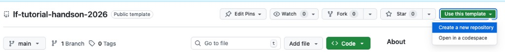
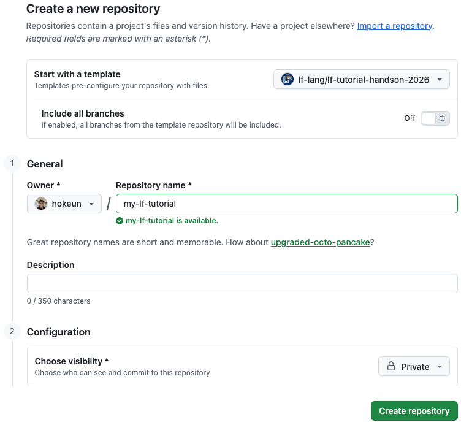

# LF Tutorial @ CPS-IoT Week 2026 - Hands-on Session: Logical Time in Distributed Systems: A Power Grid Tutorial

> **Based on:** ["Consistency vs. Availability in Distributed Cyber-Physical Systems" by Lee et al. (2023)](https://arxiv.org/abs/2301.08906)
> **Domain:** Distributed power grid control using Lingua Franca

---

## What This Tutorial Is About

Modern power grids are distributed cyber-physical systems. Generation, transmission, and load are spread across vast geographic areas. Multiple control nodes must coordinate in real time, and they must **agree** on the state of the grid even when separated by hundreds of milliseconds of network latency.

This tutorial takes you through a series of progressively more sophisticated designs for a distributed grid controller, using the [Lingua Franca (LF)](https://lf-lang.org/) coordination language. Each design exposes a new problem and motivates the next solution, culminating in a system that achieves **eventual consistency** while bounding unavailability to a manageable risk.

The design journey mirrors the consistency-vs-availability tradeoff captured by the **CAL theorem**: stronger consistency requires more waiting, more assumptions about latency, or carefully chosen fault handling. Each design makes an explicit, application-specific compromise.

---

## The Scenario

We model a minimal but realistic slice of a power grid:

- **Two regional control nodes**: one in the **Western Interconnect** (e.g., California), one in the **Eastern Interconnect** (e.g., New York).
- Each node manages a **local generation pool** (power plants it can dispatch up or down).
- Each node maintains a **shared grid state**: the current net generation balance for the whole system (positive = excess generation, negative = deficit).
- Operators at either node can issue **dispatch commands**: increase generation (+MW) or curtail generation (−MW).
- The grid is stable only when balance is near zero. An **imbalance** (too much curtailment while the balance is already negative) risks a **cascading blackout**.

This follows the paper's focus on shared physical state in real-time systems: instead of vehicles or roadside units agreeing on intersection state, we have grid controllers agreeing on generation balance. Instead of collisions, the failure mode is a grid imbalance severe enough to trip protective relays.

---

## Tutorial Structure

| Step | File | Topic |
|------|------|-------|
| 1 | [01-actor-model.md](01-actor-model.md) | The basic actor model: commutative operations and eventual consistency |
| 2 | [02-inconsistency.md](02-inconsistency.md) | When operations are non-commutative: the consistency problem |
| 3 | [03-timestamps.md](03-timestamps.md) | Adding logical timestamps to order events |
| 4 | [04-conservative.md](04-conservative.md) | Conservative coordination with Chandy-Misra null messages |
| 5 | [05-hybrid.md](05-hybrid.md) | Hybrid design: fast-path for safe commands, strong consistency for risky ones |
| 6 | [06-cal-theorem.md](06-cal-theorem.md) | The CAL theorem and fundamental limits |

---

## Key Concepts Introduced

- **Actor model** and its inherent nondeterminism
- **Physical connections** (`~>`) vs **logical connections** (`->`) in LF
- **Eventual consistency** via ACID 2.0 / CRDTs
- **Logical timestamps** and the notion of *logical time*
- **STA** (Safe To Advance) and **STAA** (Safe To Assume Absent) parameters
- **Conservative coordination** (Chandy-Misra null messages)
- **The CAL theorem**: Consistency–Availability–Latency tradeoff
- **Fault handlers** for bounded unavailability

---

## Prerequisites

- Basic familiarity with concurrent programming concepts
- Some exposure to distributed systems (helpful but not required)
- Lingua Franca installed: see [lf-lang.org](https://lf-lang.org/docs/installation)

---

## Use This Repository as a Template

This repository is a **GitHub template**. You can create your own copy to work in (so commits and experiments stay in your own repo without forking the tutorial).

1. Open the template repository on GitHub (for example `lf-lang/lf-tutorial-handson-2026`).
2. Click **Use this template**, then choose **Create a new repository** (or **Open in a codespace** if you prefer a cloud dev environment).

   

3. On the **Create a new repository** page, pick the **Owner** and **Repository name**, add an optional **Description**, choose **visibility** (Public or Private), then click **Create repository**.  
   By default only the default branch is copied; turn on **Include all branches** only if you need every branch from the template.

   

After creation, clone **your** new repository locally and follow [Running the Code](#running-the-code).

---

## Running the Code

Each `.lf` file in the `src/` directory can be compiled and run with:

```bash
lfc src/<filename>.lf
./bin/<program_name>
```

For federated programs (Steps 3 onward), each federate runs as a separate process. The LF compiler generates a launch script:

```bash
lfc src/<filename>.lf
./bin/<program_name>_launch.sh
```

# References

[1] E. A. Lee, R. Akella, S. Bateni, S. Lin, M. Lohstroh, and C. Menard, "Consistency vs. Availability in Distributed Cyber-Physical Systems," arXiv:2301.08906, 2023. [Online]. Available: https://arxiv.org/abs/2301.08906

[2] T. Zhao, Z. Li and Z. Ding, "Consensus-Based Distributed Optimal Energy Management With Less Communication in a Microgrid," in IEEE Transactions on Industrial Informatics, vol. 15, no. 6, pp. 3356-3367, June 2019, doi: 10.1109/TII.2018.2871562.


